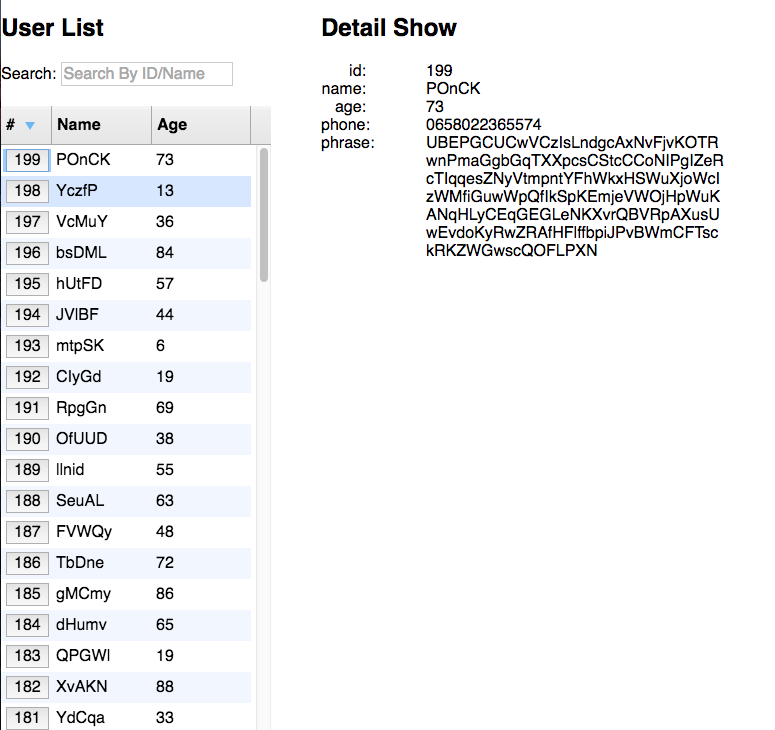

Install the demo.

```bash
$ git clone https://github.com/alanlong9278/bindo-test.git
$ cd bindo-test && npm install
// generate data
$ cd data && ruby generate_data.rb 
$ cd .. && npm start
```

Visit http://127.0.0.1:8080 with your browser.

[](img/display.mov)
## Core Concepts

According to Flux, an application should be divided into four parts.

> - **Views**: the UI layer
> - **Actions**: messages sent from Views (e.g. mouseClick)
> - **Dispatcher**: a place receiving actions, and calling callbacks
> - **Stores**: a place managing the Application's state, and reminding Views to update


> 1. User interacts with Views
> 1. Views propagate an Action triggered by user
> 1. Dispatcher receives the Action and updates the Store
> 1. Store emits a "change" event
> 1. Views respond to the "change" event and update itself

Used package
react-datagrid: show the list data
react-bootstrip: some tooltips
lodash: deal with objects
jquery: deal with json file to get data

Don't get it? Take it easy. I will give you the details soon.

## License

MIT
